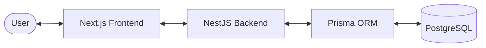

# Event Management System (EMS)

A full-stack Event Management System built with **Next.js**, **NestJS**, and **PostgreSQL**. This project demonstrates a modern web application architecture with a focus on real-world usability, including event curation, map integration, and automated recommendations.

## 🏗 System Architecture

The project is structured as a monorepo-style repository with distinct frontend and backend services:

-   **Frontend**: Built with **Next.js (App Router)** and **Material UI**. It features a responsive design, interactive maps, and real-time state updates.
-   **Backend**: A **NestJS** REST API following modular architecture principles, using **Prisma ORM** for efficient database management.
-   **Database**: **PostgreSQL** for reliable data storage.



## 🚀 Quick Start

The easiest way to get the entire system running is using Docker:

1.  **Clone the repository**:
    ```bash
    git clone <repository-url>
    cd Fs_App
    ```

2.  **Start the Database**:
    ```bash
    docker-compose up -d
    ```

3.  **Setup the Backend**:
    ```bash
    cd backend
    npm install
    npx prisma migrate dev
    npm run start:dev
    ```

4.  **Setup the Frontend**:
    ```bash
    cd ../frontend
    npm install
    npm run dev
    ```

The application will be available at [http://localhost:3000](http://localhost:3000).

## 🛠 Tech Stack

### Frontend
- **Framework**: Next.js 15 (App Router)
- **UI Library**: Material UI (MUI)
- **Styling**: Pigment CSS & Emotion
- **Maps**: React Leaflet / Leaflet
- **HTTP Client**: Axios

### Backend
- **Framework**: NestJS
- **ORM**: Prisma
- **Database**: PostgreSQL
- **Validation**: Class Validator & Class Transformer
- **Testing**: Jest & Supertest

## 📂 Project Structure

-   [`/frontend`](file:///c:/Fs_App/frontend): Next.js frontend application.
-   [`/backend`](file:///c:/Fs_App/backend): NestJS backend API.
-   [`docker-compose.yml`](file:///c:/Fs_App/docker-compose.yml): Infrastructure configuration.

---

For detailed information about each component, please refer to their respective documentation:
- [Frontend Documentation](file:///c:/Fs_App/frontend/README.md)
- [Backend Documentation](file:///c:/Fs_App/backend/README.md)
